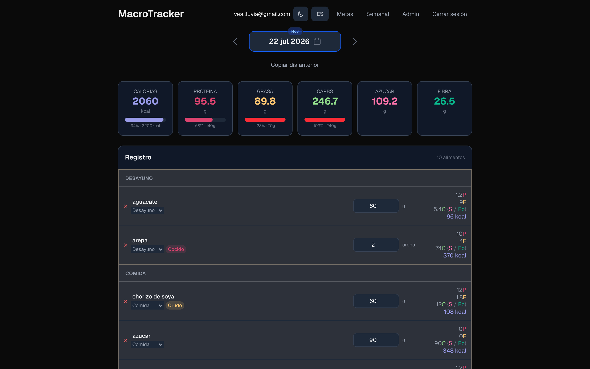
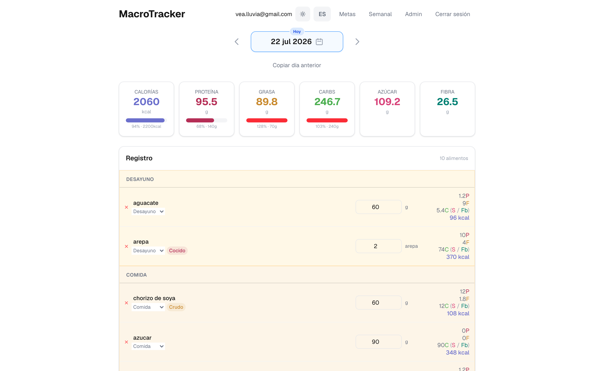
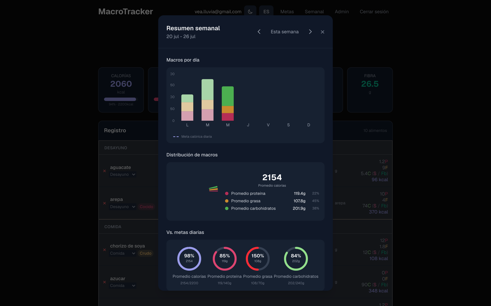
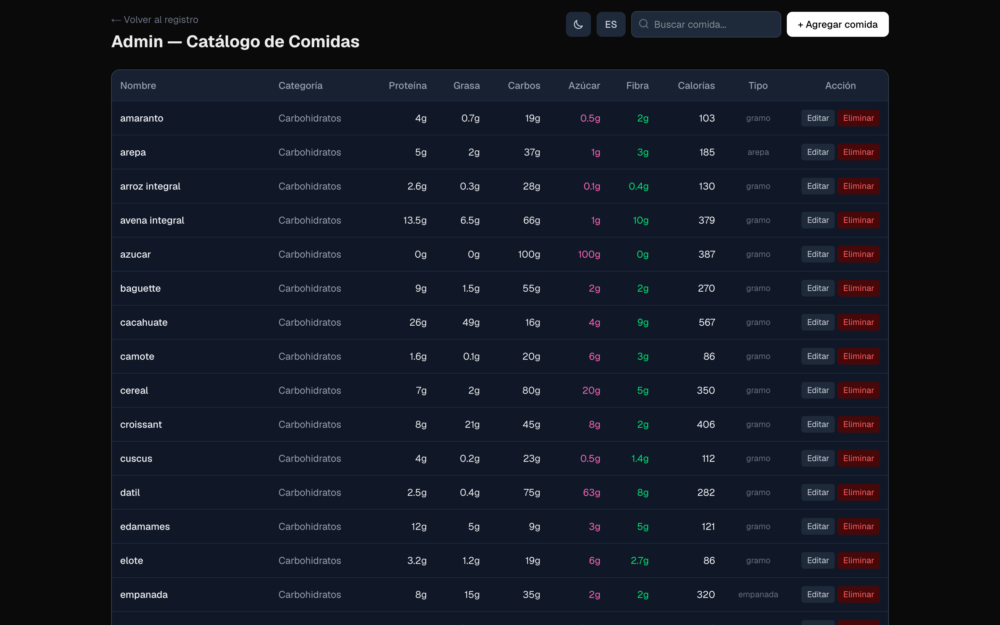
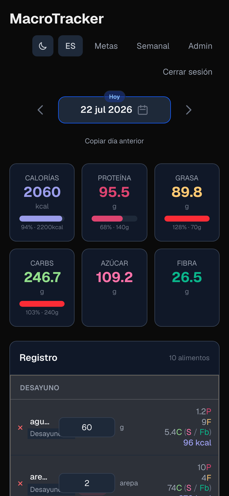

# MacroTracker Pro

[](https://macrotracker-pro.vercel.app)
[](https://github.com/lluviavea/macrotracker-pro)
[](https://nextjs.org)

Una app para registrar tu comida diaria y llevar el control de tus macronutrientes (proteína, grasa, carbohidratos y calorías).

🌐 **[Demo en vivo](https://macrotracker-pro.vercel.app)** · ✨ **[Landing page](https://lluviavea.github.io/macrotracker-pro/)**

Tu información se guarda en una base de datos PostgreSQL local (vía Docker), así que tienes control total de tus datos sin depender de servicios externos ni suscripciones.

## 🤔 ¿Por qué MacroTracker?

Porque las apps de conteo de calorías suelen ser lentas, llenas de anuncios, o te obligan a pagar una suscripción para funciones básicas. MacroTracker es minimalista, rápida, y tus datos son tuyos — viven en tu propia base de datos local.

## ✨ Funcionalidades

- **Registro diario** — Agrega alimentos con un solo clic, ajusta las cantidades en gramos o por pieza
- **Seguimiento automático** — Al registrar un alimento, los macros se calculan automáticamente
- **7 categorías** — Proteína, carbohidratos, grasas, frutas, verduras, condimentos y suplementos
- **Búsqueda bilingüe** — Encuentra cualquier alimento por nombre (ES o EN); barra de búsqueda fija con atajo `/`
- **Navegación por fechas** — Revisa días anteriores, modifica o elimina entradas
- **Metas diarias** — Define objetivos personalizados de calorías y macros con barras de progreso
- **Favoritos** — Fija los alimentos que más usas para acceder rápidamente
- **Recuerda la última comida** — Pre-selecciona la comida en la que sueles registrar cada alimento
- **Modo oscuro/claro** — Tema adaptable con detección automática de preferencia del sistema
- **Catálogo editable** — Pantalla de admin para agregar, editar y eliminar alimentos
- **Bilingüe** — Interfaz en español e inglés
- **Totales en tiempo real** — Ve el resumen del día al instante

## 📸 Capturas

| Modo oscuro | Modo claro |
| --- | --- |
|  |  |
|  |  |



> Las capturas se regeneran con `just screenshots` (requiere el dev server corriendo). Ver [`docs/testing.md`](docs/testing.md).

## 🚀 Comenzar

```bash
just setup     # Una sola vez: dependencias, base de datos, esquema y datos iniciales
just run       # Cada día: levanta la base de datos si no está corriendo, migra y abre http://127.0.0.1:3000
```

> **Nota técnica**: Necesitas [mise](https://mise.jdx.dev), [just](https://github.com/casey/just), y [Docker](https://www.docker.com/) corriendo. Consulta [`docs/architecture.md`](docs/architecture.md) para entender la estructura del proyecto y [`docs/admin.md`](docs/admin.md) si quieres gestionar el catálogo.

## 📖 Documentación técnica

- [`docs/architecture.md`](docs/architecture.md) — Estructura del proyecto, flujo de datos, API
- [`docs/nutrition.md`](docs/nutrition.md) — Cálculo de macros, tipos de medida
- [`docs/admin.md`](docs/admin.md) — Pantalla de admin para gestionar el catálogo
- [`docs/goals.md`](docs/goals.md) — Sistema de metas diarias (localStorage)
- [`docs/theme.md`](docs/theme.md) — Modo oscuro/claro
- [`docs/testing.md`](docs/testing.md) — Tests unitarios y e2e
